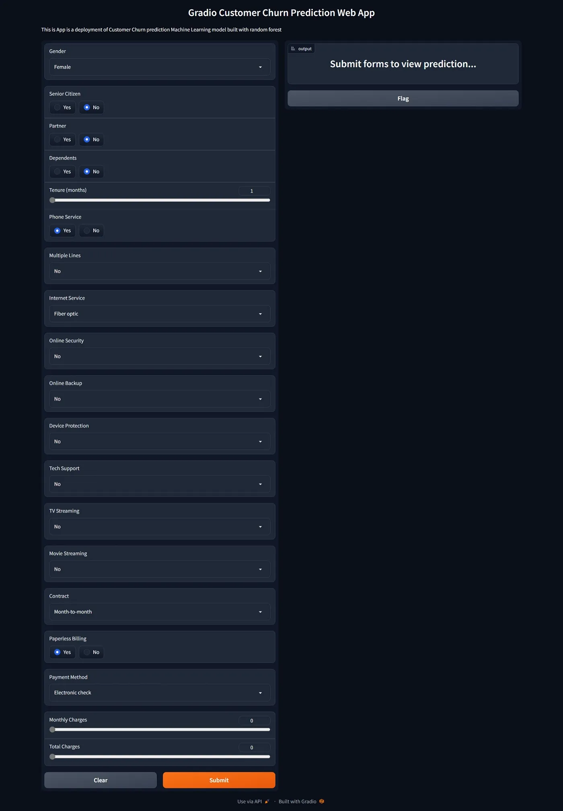

# GRADIO-APP-FOR-SALES-PREDICTION-FOR-CUSTOMER-CHURN
Gradio Web app for classification project to predict customer churn

## Summary
| Code      | Name        | Published Article |  Deployed App |
|-----------|-------------|:-------------:|------:|
| LP4       | Streamlit-app   |  STREAMLIT APP FOR SALES PREDICTION USING EMBEDDED MACHINE LEARNING MODEL | Sales predictor app
| LP4       | Gradio-app      |  GRADIO APP FOR SALES PREDICTION FOR CUSTOMER CHURN | Customer churn prediction app

## APP TYPE
GRADIO

## APP INTERFACE

## Author
Richard Mensah
